# OpenGL Renderer Box

基于 OpenGL 的简陋 Demo

目的是把学到的东西用起来，在用的过程中思考如何解决问题。

顺带多用用 C++，多踩踩坑。

# 进度记录

- [x] 鼠标选择、物体的屏幕空间包围框
- [x] 物体位置、大小、旋转控件

| Position | Size | Rotate |
|----------|------|--------|
| 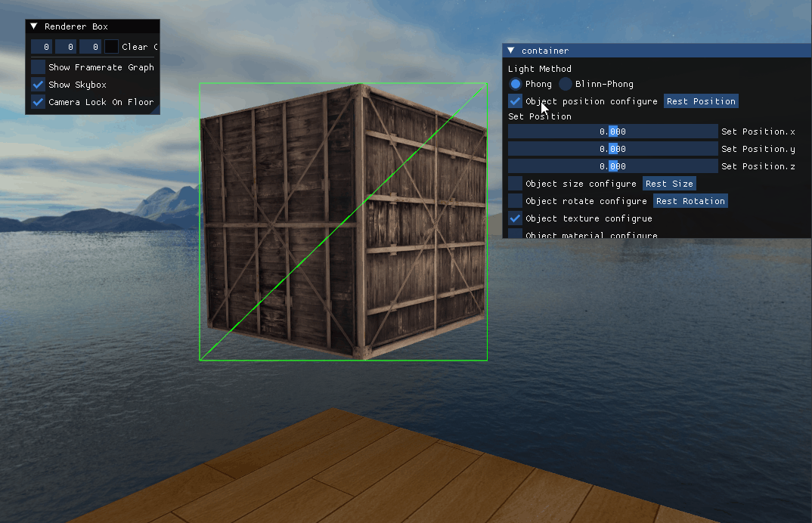 | 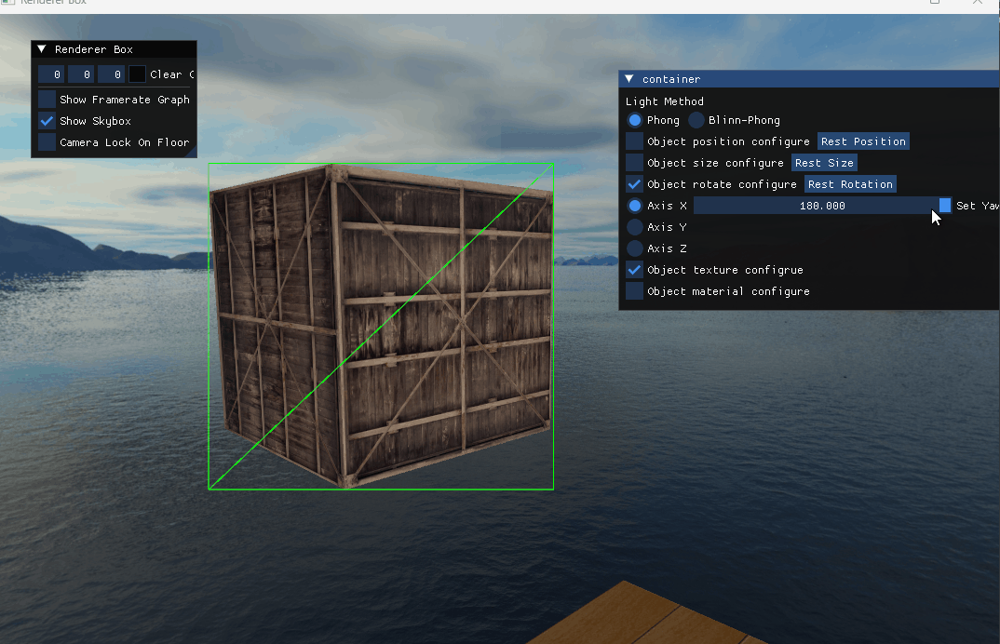  |  |

- [x] 缩放不影响贴图

- [x] Phong、Blinn-Phong 光照模型

| Phong | Blinn-Phong |
|----------|------|
| 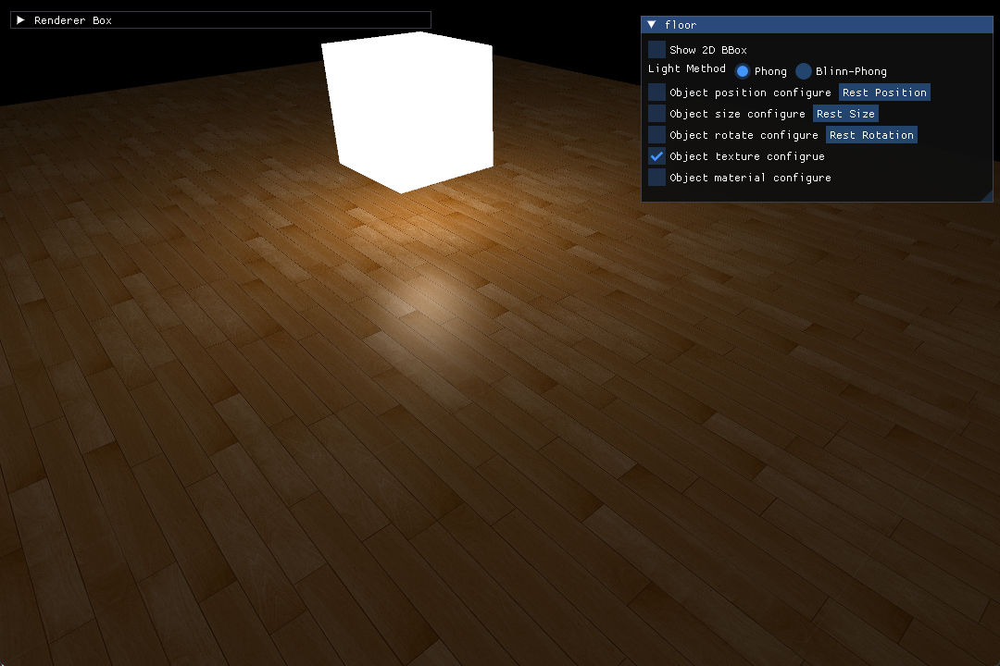 | 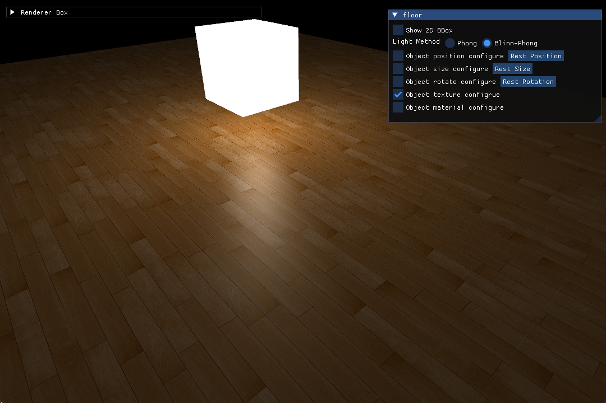  |

反光度为 0.5 时，Phong 和 Blinn-Phong 着色效果对比：

| Phong (shininess = 0.5) | Blinn-Phong (shininess = 0.5) |
|----------|------|
| 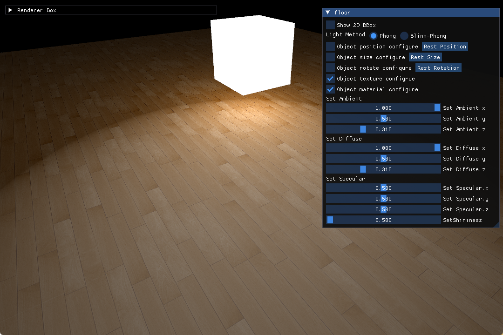 | 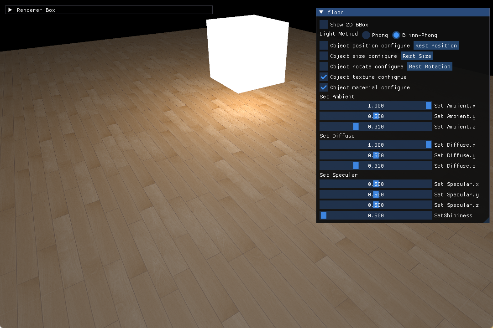  |

- [x] [阴影](./doc/Shadow.md)

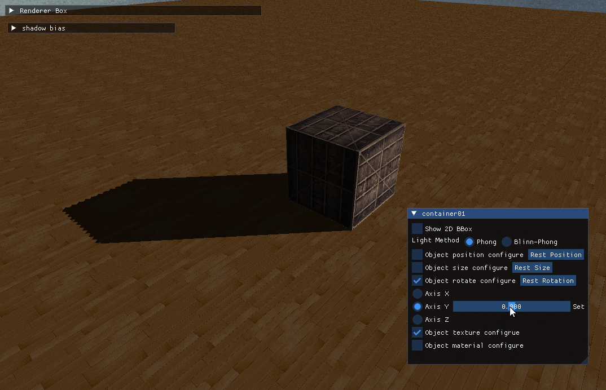

- [x] BVH

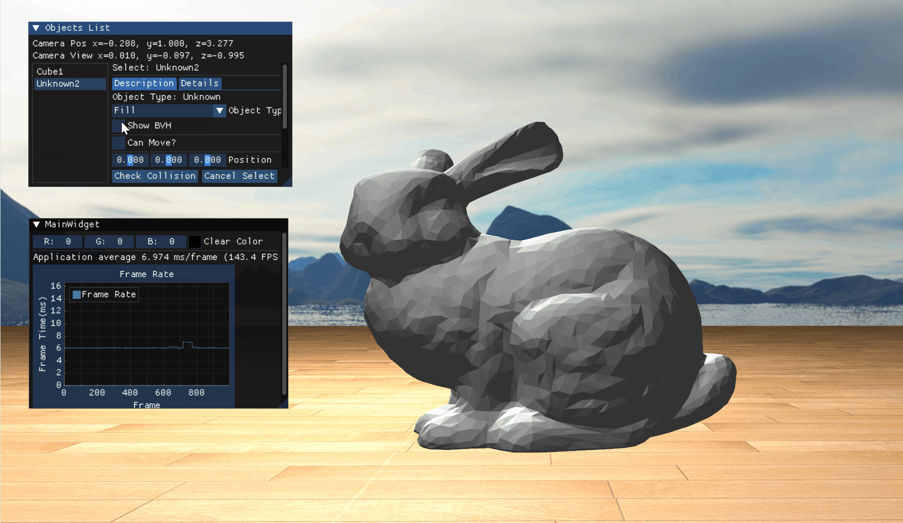

- [x] IBL

- 存在问题：环境贴图上像素缺失

|   |   |
|---|---|
|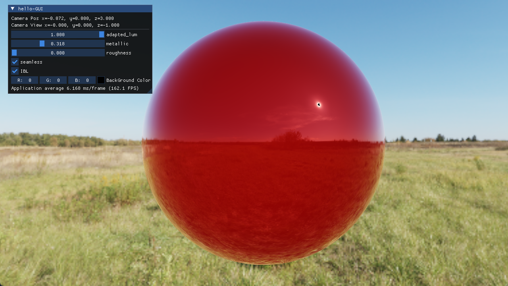|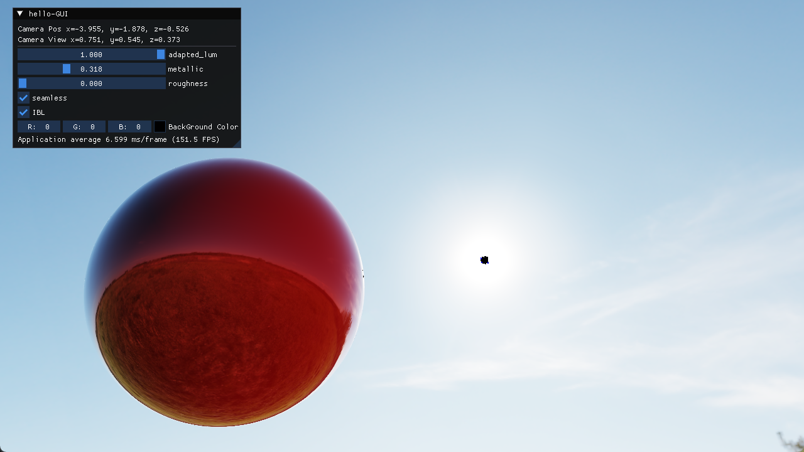|

- 问题分析一：对比其他贴图发现主要问题都出现在贴图中具有太阳这种强光源的情况下，如果没有强光源则不会出现这个问题
- 问题分析二：怀疑是 HDR 的问题，在着色器中又进行了一次 HDR tonemap 计算，无法解决
- 问题分析三：直接在 ps 中在光源位置设置一个白色矩形，问题消失

原图中肉眼无法看出问题，推测是源文件中光源中存在几个像素大小的信息缺失的问题，贴图从矩形映射到场景内部导致这部分区域被拉伸变大，从而变得可见。

| 问题分析三结果图 ||
|---|---|
| 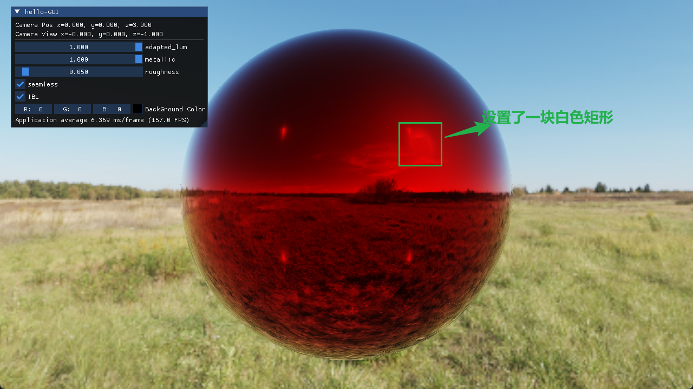 | 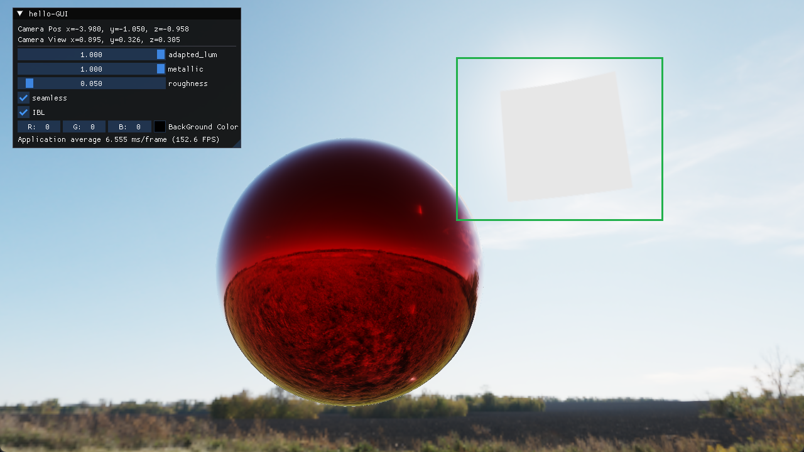 |

