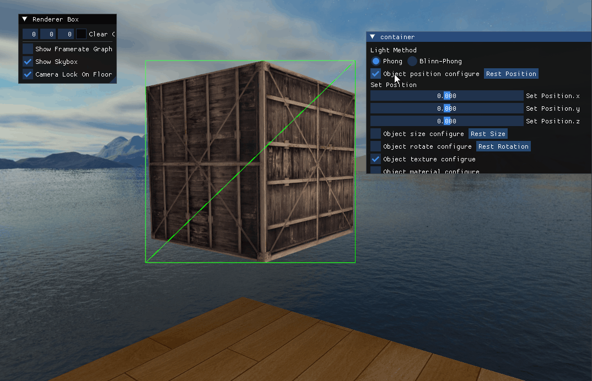
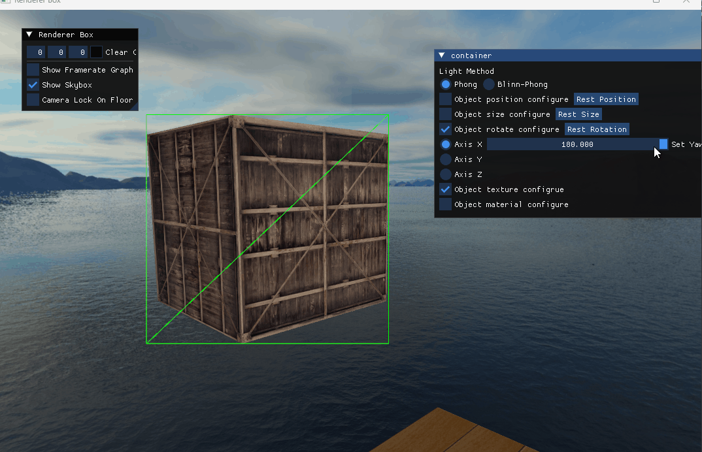
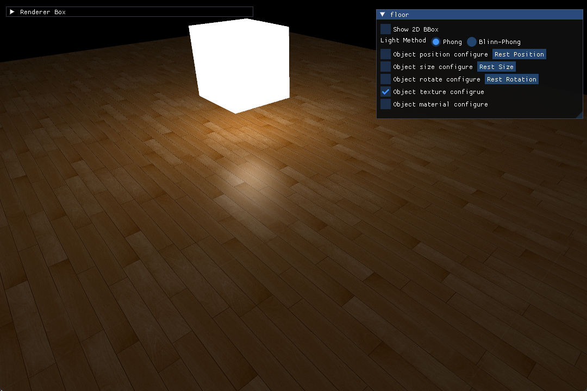
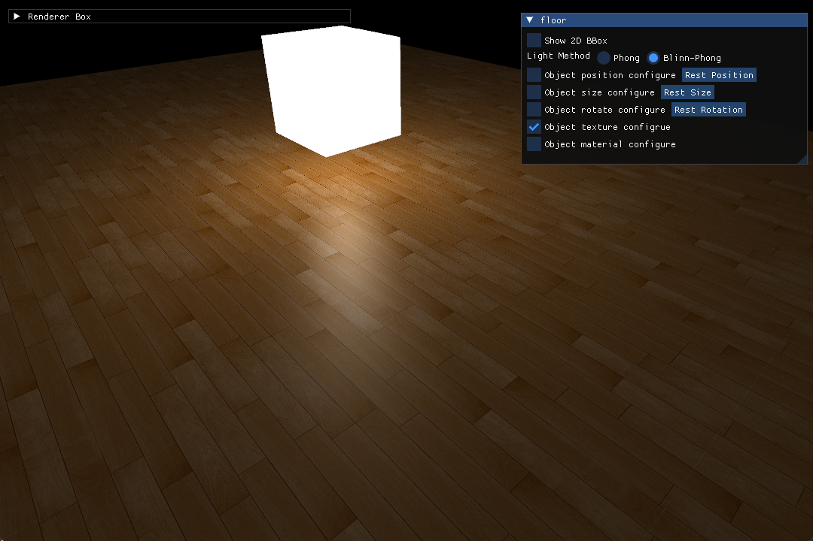
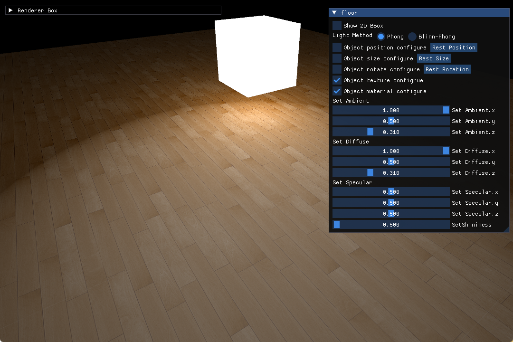
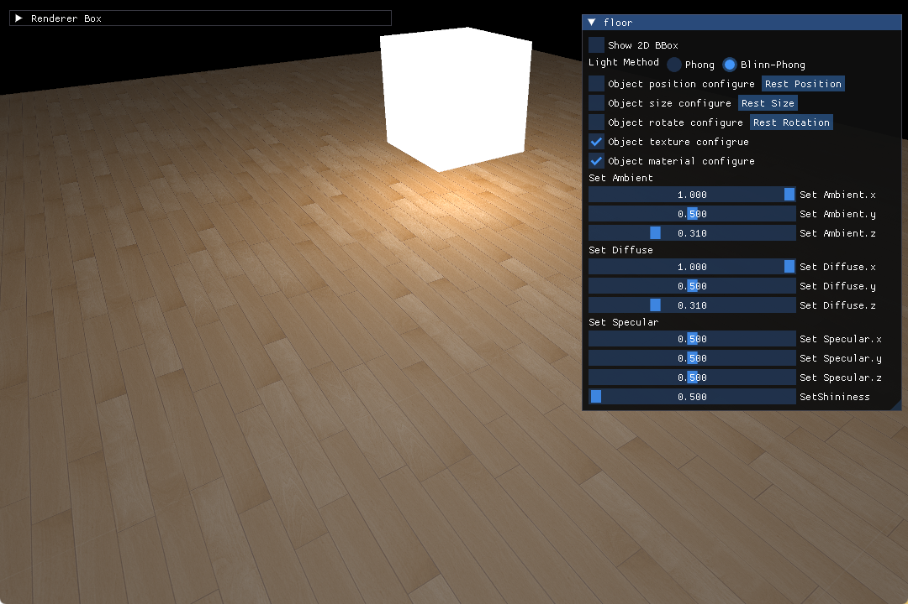

# OpenGL Renderer Box

基于 OpenGL 的简陋 Demo

目的是把学到的东西用起来，在用的过程中思考如何解决问题。

顺带多用用 C++，多踩踩坑。

# 进度记录

- [x] 鼠标选择、物体的屏幕空间包围框
- [x] 物体位置、大小、旋转控件

| Position | Size | Rotate |
|----------|------|--------|
|  |   |  |

- [x] 缩放不影响贴图

- [x] Phong、Blinn-Phong 光照模型

| Phong | Blinn-Phong |
|----------|------|
|  |   |

反光度为 0.5 时，Phong 和 Blinn-Phong 着色效果对比：

| Phong (shininess = 0.5) | Blinn-Phong (shininess = 0.5) |
|----------|------|
|  |   |

TODO:
- [ ] 实现阴影
- [ ] 点光源阴影
- [ ] 实现 MSAA（不使用 OpenGL）
- [ ] 实现 PBR + IBL

- 暂缓
  - [ ] 绘制坐标轴（世界、直立、局部）
  - [ ] 增加依据直立坐标轴的移动，旋转控制

