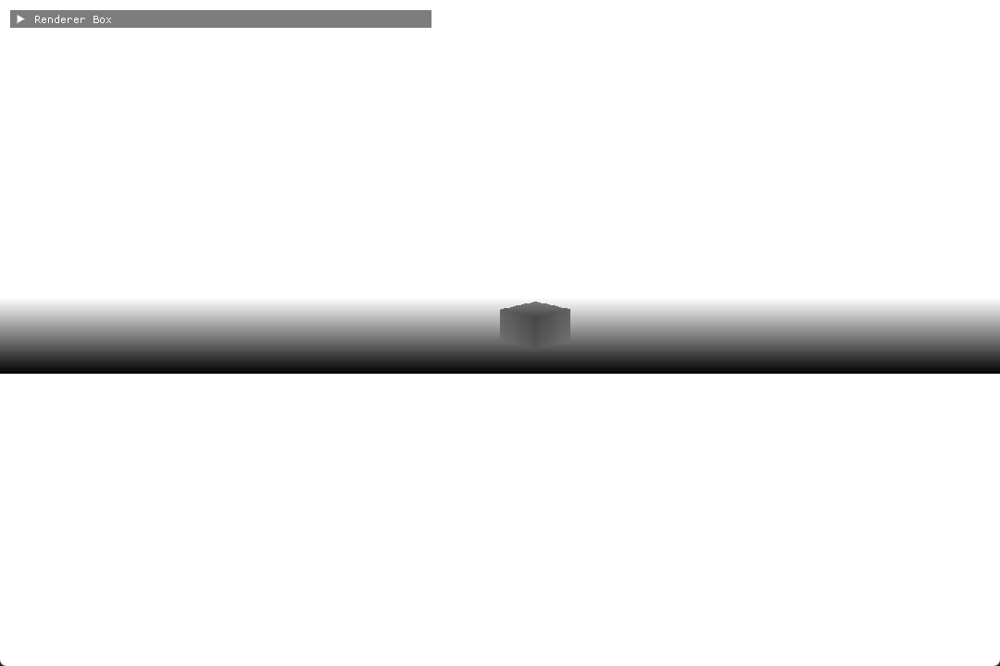
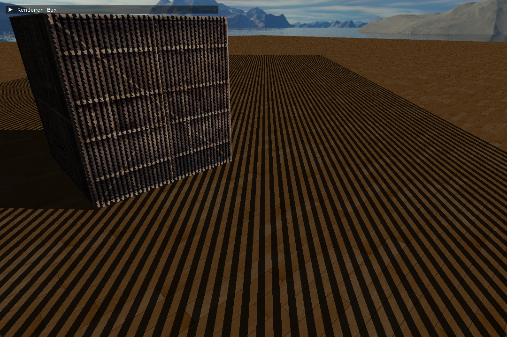
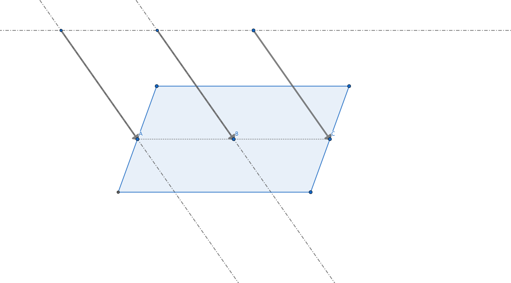
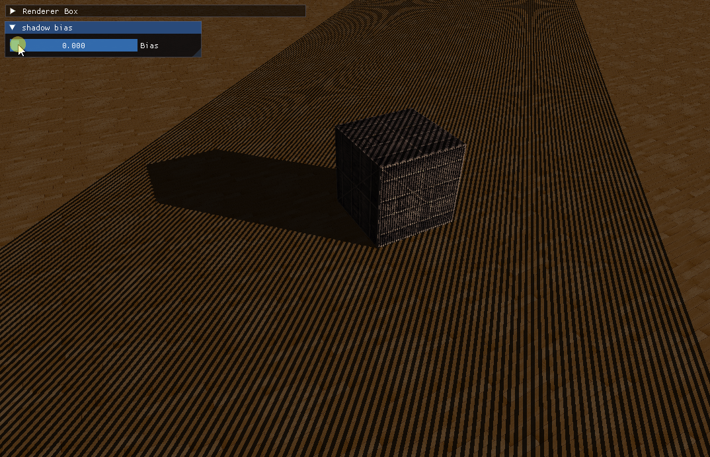

> 阴影是光线被物体阻挡的结果
>
> 1. 使得场景更为真实
> 2. 反应物体之间的相对位置关系，反应深度信息

**目前在实时渲染领域还没有找到一种完美的阴影算法。游戏中使用最多的一种技术为：阴影贴图（shadow mapping）**

# 阴影映射

## 技术讨论

**核心思想**：将相机放在光源位置，此时能看到的部分都是能够被该光源照亮的部分，其余看不到的部分都是处于阴影之中的。

**实现方式**：利用射线检测，从光源位置发出射线对场景中物体进行遍历，并更新射线和物体碰撞的最近点，其余点都位于阴影中。

**存在问题**：从光源生成大量的射线十分消耗性能，实时渲染不可取。

**折中方案**：
- 从光源位置出发渲染场景的透视图，将场景的深度信息存储到纹理，这个纹理叫做**深度贴图（depth map）**。
- 在相机视角渲染场景时，顺便计算**该点在光源视角下的深度值**
- 从深度贴图中获取对应位置的深度信息
- 如果深度值更小说明该点被照亮，否则说明处于阴影。

## 问题与解决

### 阴影失真 (Shadow Acne)

如图所示，场景中出现了不自然的交替黑线，即**阴影失真 (Shadow Acne)**问题

假设一个点经过光源空间的矩阵变换后为 $(x_i, y_i, z_i)$，这其中的 $z_i$ 即为该点在光源空间的深度值，再从深度贴图中获取深度信息，比较二者即可判断该点是否处于阴影中。

但是由于深度贴图分辨率优先，不可能存在任意一个 $(x, y)$ 都能有唯一的深度信息。这里记深度贴图的像素宽高为 $(\Delta_X, \Delta_Y)$。

从而有，任意满足 $(0, 0) < (x-x_i, y-y_i) < (\Delta_X, \Delta_Y)$ 的点 $(x, y)$ 都会从深度贴图中获取同一个深度信息。

如下图中，平行光打到一个在纹理上取同一个深度值的片段。由于平行光和片段存在角度，这导致从光源位置计算深度时，C 点深度会比 B 点深度更大。

最终该片段存入深度贴图中的深度信息为 B 点的深度值，而失去了 A 点和 C 点的深度信息。

这就导致进行阴影映射时，记 A 的坐标为 $(x_A, y_A)$，根据光空间矩阵计算得到的深度为 $z_A$，从深度贴图中映射得到的深度值为 $z_B$。从而有 $z_A < z_B$ 说明 A 能够被光源照亮；而对于 C 点有 $z_C > z_B$，说明 C 点处于阴影。

这就导致 B 到 A 之间的片段照亮，B 到 C 之间的片段为阴影，从而出现了交错的黑色条纹。

故，阴影失真（shadow acne）的产生原因是：**深度贴图的分辨率有限，多个片段的深度值采样可能为同一个值**

### 阴影偏移 (Shadow Bias)

一种解决办法是**阴影偏移（shadow bias）**

具体方法是：由于 B 点深度值小于 C 点深度值，那就想办法让 B 点深度值变大，或者 C 点深度值变小。

即： $z_C - bias$ 或 $z_B + bias$

从而使得，$z_C - bias < z_B$ ，使得 C 点被判定为照亮

如上图所示，当 bias 取 0.005 时效果已经足够好

### 阴影悬浮 (Peter Panning) 

### 正面剔除

### 光的视锥外阴影问题
