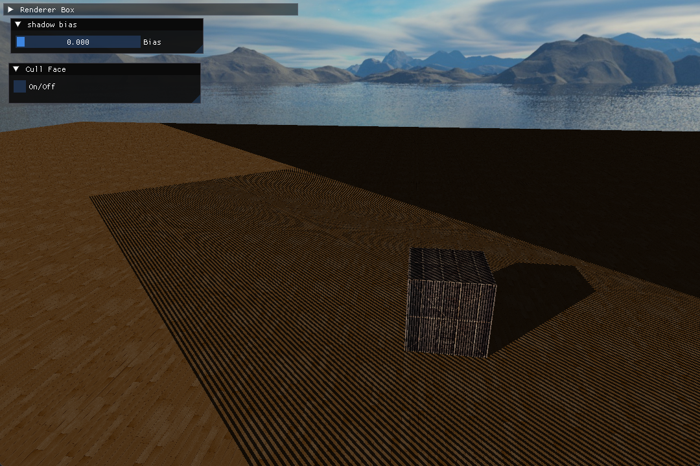

> 阴影是光线被物体阻挡的结果
>
> 1. 使得场景更为真实
> 2. 反应物体之间的相对位置关系，反应深度信息


**目前在实时渲染领域还没有找到一种完美的阴影算法。游戏中使用最多的一种技术为：阴影贴图（shadow mapping）**

# 阴影映射

## 技术讨论

**核心思想**：将相机放在光源位置，此时能看到的部分都是能够被该光源照亮的部分，其余看不到的部分都是处于阴影之中的。

**实现方式**：利用射线检测，从光源位置发出射线对场景中物体进行遍历，并更新射线和物体碰撞的最近点，其余点都位于阴影中。

**存在问题**：从光源生成大量的射线十分消耗性能，实时渲染不可取。

**折中方案**：
- 从光源位置出发渲染场景的透视图，将场景的深度信息存储到纹理，这个纹理叫做**深度贴图（depth map）**
- 在相机视角渲染场景时，顺便计算**该点在光源视角下（最近的）深度值**
- 从深度贴图中获取对应位置的深度信息
- 如果深度值更小说明该点被照亮，否则说明处于阴影。


## 问题与解决

### 阴影失真 (Shadow Acne)

如图所示，场景中出现了不自然的交替黑线，即**阴影失真 (Shadow Acne)**问题


假设一个点经过光源空间的矩阵变换后为 $(x_i, y_i, z_i)$，这其中的 $z_i$ 即为该点在光源空间的深度值，再从深度贴图中获取深度信息，比较二者即可判断该点是否处于阴影中。

但是由于深度贴图分辨率优先，不可能存在任意一个 $(x, y)$ 都能有唯一的深度信息。这里记深度贴图的像素宽高为 $(\Delta_X, \Delta_Y)$。

从而有，任意满足 $(0, 0) < (x-x_i, y-y_i) < (\Delta_X, \Delta_Y)$ 的点 $(x, y)$ 都会从深度贴图中获取同一个深度信息。

如下图中，平行光打到一个在纹理上取同一个深度值的片段。由于平行光和片段存在角度，这导致从光源位置计算深度时，C 点深度会比 B 点深度更大。


最终该片段存入深度贴图中的深度信息为 B 点的深度值，而失去了 A 点和 C 点的深度信息。

这就导致进行阴影映射时，记 A 的坐标为 $(x_A, y_A)$，根据光空间矩阵计算得到的深度为 $z_A$，从深度贴图中映射得到的深度值为 $z_B$。从而有 $z_A < z_B$ 说明 A 能够被光源照亮；而对于 C 点有 $z_C > z_B$，说明 C 点处于阴影。

这就导致 B 到 A 之间的片段照亮，B 到 C 之间的片段为阴影，从而出现了交错的黑色条纹。

故，阴影失真（shadow acne）的产生原因是：**深度贴图的分辨率有限，多个片段的深度值采样可能为同一个值**


### 阴影偏移 (Shadow Bias)

一种解决办法是**阴影偏移（shadow bias）**

具体方法是：由于 B 点深度值小于 C 点深度值，那就想办法让 B 点深度值变大，或者 C 点深度值变小。

即 $z_C - bias$ 或 $z_B + bias$

从而使得 $z_C < z_B + bias$ 使得 C 点被判定为照亮


如上图所示，当 bias 取 0.005 时效果已经足够好


### 阴影悬浮 (Peter Panning) 

如果继续调大 bias 发现阴影会逐渐和物体分离，呈现出“物体悬空”的效果


原因是：**阴影偏移本质上是改变了片段在深度贴图中的映射**

借助之前的平行光参考图，对每一次的点 B 的参考深度值都进行偏移，相当于将贴图映射整体移动了一定距离。从而导致本该出现阴影的地方，取到了被照亮的位置的深度值。


### 正面剔除

可以直接通过开启正面剔除来消除外部的 Shadow Acne

|开启 Cull Front Face|关闭 Cull Front Face|
|---|---|
|||

**实际上，正面剔除只是将 Shadow Acne 出现位置进行的更改，如果此时进入立方体内部，会发现在内部出现了 Shadow Acne**


同时，这种方法由于精度问题会导致立方体和阴影交界处出现漏光现象


以及，这种方法只对**具有体积的物体**可以生效。

**正面剔除能够消除部分 Shadow Acne 的原因**：


参考上图，剔除正面时，渲染到 DepthMap 中的深度信息是图中红色部分。很显然，此时物体的 AB 和 AC 两个面的深度值一定比 DepthMap 中对应位置更小，因为必定会被判定为照亮。

如果不进行正面剔除，DepthMap 中存储的深度信息为图中灰色部分。而深度贴图由于精度问题会损失很多位置的深度值，从而导致多个位置共用一个参考深度，最终导致了 Shadow Acne。

**综上**，Cull Front Face 其实本质上和 Shadow Bias 并没有什么区别，二者根本上都是**将用于判断是否处于阴影中的参考深度值进行了一定的调整**。


### 光的视锥外阴影问题

先前的问题中，我将这部分问题修正。这里进行单独讨论。

正常来说，直接使用 DepthMap 而不对 Shadow Acne 修正会出现如下图所示的问题，即：有一部分区域一直处于阴影之中。


如果需要设置阴影的区域比较小，可以直接设置区域外固定处于阴影或者固定被照亮（不产生阴影），效果图如之前展示所示。

OpenGL 中解决办法如下：

```cpp
glTexParameteri(GL_TEXTURE_2D, GL_TEXTURE_WRAP_S, GL_CLAMP_TO_BORDER);
GLfloat borderColor[] = {1.0, 1.0, 1.0, 1.0};
glTexParameterfv(GL_TEXTURE_2D, GL_TEXTURE_BORDER_COLOR, borderColor);
```

即，设置纹理 `GL_CLAMP_TO_BORDER` 和边缘位置的颜色，上方代码设置边缘位置为白色，从而使得区域外固定照亮并不产生阴影

此时运行发现，横向部分的阴影问题解决，但是后方仍然有一大片部分处于阴影。



**原因**：这是因为这部分区域超出了光源的投影远平面，从而导致一直比 DepthMap 中的深度值更大，判定为处于阴影之中。

这里的解决办法也可以直接在着色器中进行设置，计算得到片段在光投影空间中的深度值 `projCoords.z` 之后判断是否大于 1，表示片段是否位于远平面之外，固定这部分的 `shadow=0`，即同样设置为不生成阴影。

最终解决如[README.md](../README.md)中所示

# 其他阴影技术


## Percentage-Closer Filtering(PCF)

**目的**：模拟阴影的柔和边缘，实现软阴影

**核心思想**：从深度贴图中多次采样计算平均值

```cpp
float shadow = 0.0;
vec2 texelSize = 1.0 / textureSize(shadowMap, 0);
for(int x = -1; x <= 1; ++x)
{
    for(int y = -1; y <= 1; ++y)
    {
        float pcfDepth = texture(shadowMap, projCoords.xy + vec2(x, y) * texelSize).r; 
        shadow += currentDepth - bias > pcfDepth ? 1.0 : 0.0;        
    }    
}
shadow /= 9.0;
```

效果：


**存在问题**
- **预过滤困难**：需要对深度贴图多次采样模糊阴影边缘。由于每次采样需要访问深度贴图中的多个像素，因此在进行预过滤时，需要考虑如何确保不会丢失过多的细节或者导致阴影质量下降
- **各向异性过滤困难**：采样窗口固定，处理各向异性阴影效果（可能需要修改的采样窗口）时存在困难
- **Mipmap 使用受限**：PCF 通常只能在深度贴图的基本级别上进行采样，而不能有效地利用深度贴图的 mipmap 层级结构。由于 PCF 的采样窗口大小是固定的，因此在使用 mipmap 时，需要考虑如何动态调整采样窗口大小以适应不同的 mipmap 层级，以获得更好的效果


